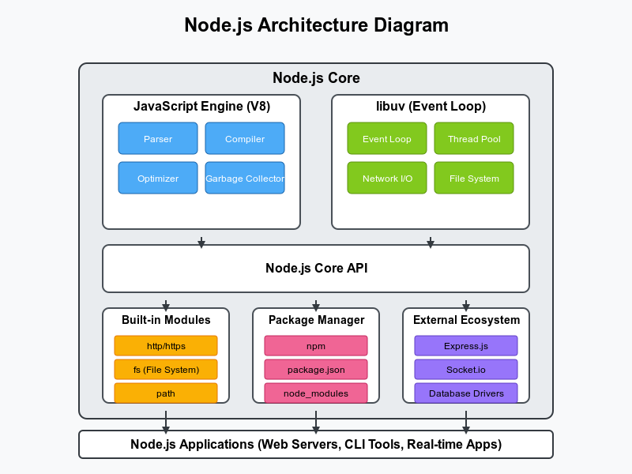
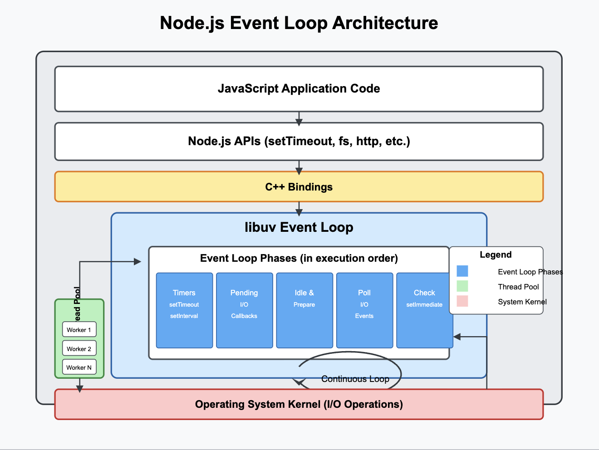

# Understanding Node.js Architecture & Event Loop

Let's explore how Node.js works from the ground up in straightforward terms.

## What is Node.js?

Node.js is a platform that lets you run JavaScript code outside of a web browser. Before Node.js came along, JavaScript was mostly limited to browsers, but Node.js changed that by allowing developers to use JavaScript to build server-side applications.


## The Core Architecture



At its heart, Node.js is built on three main components:

1. **V8 JavaScript Engine**: This is the same engine that powers Google Chrome. It takes your JavaScript code and converts it into machine code that your computer can execute.

2. **Libuv**: This is a C library that gives Node.js access to the operating system's features like file system, networking, and concurrency. It's responsible for Node's asynchronous behavior.

3. **Node.js Core Library**: Written in JavaScript, this provides the API that developers use to build applications.

## The Single-Threaded Nature

One of the most important things to understand about Node.js is that it runs on a single thread. Imagine a single worker (the thread) processing tasks one after another.

But wait - if there's only one worker, how does Node.js handle multiple operations efficiently? This is where the event loop comes in.


## The Event Loop: Node's Secret Sauce

Think of the event loop as a smart task manager. Here's how it works:

1. **Event Queue**: When your Node.js application needs to perform operations (like reading a file or making a network request), these tasks are placed in a queue.

2. **Non-Blocking Operations**: Instead of waiting for a task to complete before moving on, Node.js registers a callback function and continues executing other code.

3. **Event Loop Phases**: The event loop runs through several phases in a specific order:

   - **Timers**: Executes callbacks scheduled by `setTimeout()` and `setInterval()`
   - **Pending Callbacks**: Executes callbacks for some system operations
   - **Poll**: Retrieves new I/O events and executes their callbacks
   - **Check**: Executes callbacks set by `setImmediate()`
   - **Close Callbacks**: Executes callbacks like `socket.on('close', ...)`

## How It All Works Together

Let me walk you through a typical scenario to illustrate how Node.js handles operations:

1. Your Node.js application starts, and the main script is executed.
2. When the script encounters an asynchronous operation (like reading a file), Node.js:
   - Registers the operation with the appropriate system API
   - Attaches a callback function to be executed when the operation completes
   - Continues executing the rest of the script
3. When the asynchronous operation completes, the callback is placed in the appropriate queue
4. The event loop picks up this callback when it reaches the right phase and executes it

## A Real-World Example

Let's see how this works with a simple file reading operation:

```javascript
console.log("Start");

// This operation is handed off to the file system
fs.readFile('example.txt', (err, data) => {
  if (err) {
    console.log("Error reading file");
  } else {
    console.log("File contents:", data.toString());
  }
});

console.log("End");
```

Here's what happens when this code runs:

1. "Start" is printed to the console
2. The `readFile` operation is registered with the file system
3. Node.js continues and immediately prints "End" to the console
4. When the file reading is complete, the callback function is placed in the event queue
5. The event loop picks up and executes this callback when it reaches the poll phase
6. "File contents: [data]" is printed to the console

## Worker Threads: Handling CPU-Intensive Tasks

While Node.js is single-threaded, it does provide a way to use multiple threads for CPU-intensive tasks through the Worker Threads module. This allows you to run JavaScript in parallel threads that don't block the main thread.

## The Call Stack, Callback Queue, and Event Loop Together

Let's tie everything together to understand how Node.js processes code:

1. **Call Stack**: This is where your synchronous code executes. Functions are pushed onto and popped off this stack as they are called and completed.

2. **Node.js APIs**: When an asynchronous operation is encountered, it's handed off to the appropriate Node.js API.

3. **Callback Queue**: When the asynchronous operation completes, its callback is placed in the appropriate queue.

4. **Event Loop**: Continuously checks if the call stack is empty. If it is, it takes the first callback from the queue and pushes it onto the call stack for execution.

## Why This Architecture Matters

This design makes Node.js exceptionally good at handling many concurrent connections with minimal overhead. Instead of creating a new thread for each connection (which would consume a lot of memory), Node.js handles thousands of connections on a single thread through event-driven, non-blocking I/O.

This approach is particularly well-suited for applications that need to handle many simultaneous connections but where each connection doesn't require heavy CPU computation.

Does this explanation help you understand Node.js architecture and the event loop? Would you like me to elaborate on any specific part of how Node.js works?